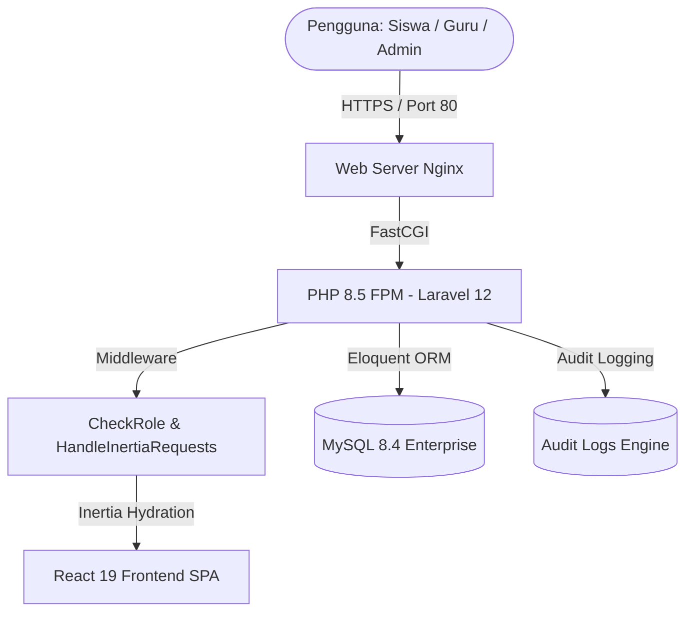

<p align="center">
  
</p>

<h1 align="center">📚 EDUSYNC — Enterprise School Management & Scheduling System</h1>

<p align="center">
  Sistem Informasi Manajemen Sekolah, Jadwal Pelajaran Dinamis, dan Monitoring KBM Real-time Berbasis Standar Kurikulum Merdeka & Dapodik SMK Kejuruan.
</p>

<p align="center">
  
  
  
  
  
  
</p>

---

## 📌 Daftar Isi
1. [Tentang EDUSYNC](#-tentang-edusync)
2. [Fitur Unggulan Sistem](#-fitur-unggulan-sistem)
3. [Arsitektur & Tech Stack](#-arsitektur--tech-stack)
4. [Struktur Portal & Hak Akses](#-struktur-portal--hak-akses)
5. [Integritas Data & Logika Bisnis](#-integritas-data--logika-bisnis)
6. [Akun Demo & Kredensial](#-akun-demo--kredensial)
7. [Panduan Instalasi & Menjalankan Aplikasi](#-panduan-instalasi--menjalankan-aplikasi)
8. [Rangkaian Pengujian Otomatis](#-rangkaian-pengujian-otomatis)
9. [Struktur Database & Hubungan Model](#-struktur-database--hubungan-model)
10. [Lisensi & Kontribusi](#-lisensi--kontribusi)

---

## 🌟 Tentang EDUSYNC

**EDUSYNC** adalah platform enterprise modern pengelolaan operasional satuan pendidikan kejuruan (SMK) yang mengintegrasikan penyusunan jadwal pelajaran (*dynamic matrix scheduling*), presensi kehadiran siswa & guru harian, penugasan KBM mandiri (jamkos terarah), manajemen izin dinas luar guru, rekap denda kebersihan 5R, hingga verifikasi bukti piket siswa secara terpusat dan *real-time*.

Dikembangkan khusus untuk mendukung kompleksitas sekolah kejuruan dengan puluhan rombongan belajar (rombel), bengkel/lab spesialisasi kejuruan, dan sistem blok kurikulum.

---

## 🚀 Fitur Unggulan Sistem

### 1. 🛡️ Admin Curriculum Control Center (16 Modul Utama)
- **Real-time Attendance Analytics**: Dashboard statistik kehadiran siswa (Hadir, Sakit, Izin, Alpha) yang terhitung otomatis dan ter-reset setiap pukul 00:00 WIB.
- **KBM Live Monitor & Radar Kelas**: Matriks visual status seluruh ruang kelas dan mata pelajaran yang sedang berlangsung.
- **Schedule Builder & Conflict Engine**: Manajemen alokasi JP dengan deteksi otomatis 3 jenis tabrakan:
  - `TEACHER_COLLISION`: Mencegah 1 guru mengajar di 2 kelas berbeda pada jam yang sama.
  - `CLASSROOM_COLLISION`: Mencegah 1 kelas dijadwalkan 2 mapel bersamaan.
  - `ROOM_COLLISION`: Mencegah 1 ruangan fisik/bengkel dipakai 2 rombel bersamaan.
- **Manajemen Siswa & Guru**: CRUD terpadu dengan sinkronisasi NISN, NIP, kode pengajar unik, dan pengaturan rombel Dapodik.
- **Verifikasi Akun Registrasi**: Skema verifikasi persetujuan (Approve/Reject) bagi pendaftaran akun siswa dan guru baru untuk mencegah akses tidak sah dari luar sekolah.
- **Manajemen Inval Guru (Persetujuan Substitusi)**: Persetujuan pertukaran guru pengampu dilengkapi validasi jadwal pengganti.
- **Izin Keluar Dinas Resmi**: Penerbitan disposisi tugas dinas luar guru dengan nomor surat tugas dan pelaporan kepulangan.
- **Laporan Sampah & Denda Kelas**: Konversi laporan kebersihan menjadi denda kas kelas secara atomik (`DB::transaction`).
- **Relokasi Ruang Fisik Dinamis**: Pemindahan ruang fisik kelas yang otomatis mengupdate seluruh alokasi jadwal KBM tanpa menimbulkan tabrakan ruangan.
- **Audit Logs Komprehensif**: Pencatatan jejak audit (aktivitas, IP address, waktu) untuk setiap perubahan kritis.
- **Rekap & Ekspor Data**: Rekap presensi siswa, kehadiran guru, dan kas denda kelas per rentang tanggal.

### 2. 👨‍🏫 Teacher Workspace (Ruang Kerja Guru)
- **Timeline Mengajar Hari Ini**: Penanda visual jam mengajar aktif dan kelas berikutnya.
- **Presensi Harian Mandiri**: Check-in kehadiran harian (Hadir, Izin Dinas, Sakit) langsung dari gawai.
- **Pengajuan Inval / Tukar Jam Mengajar**: Pengajuan tukar jam dengan validasi bentrok, pencegahan memilih diri sendiri, dan pengecekan jadwal guru pengganti.
- **Penerbitan Tugas KBM Mandiri**: Publikasi materi dan instruksi tugas terarah saat guru berhalangan hadir di kelas.
- **Pengajuan Izin Keluar Dinas**: Form pengajuan dinas luar sekolah ke kurikulum.
- **Laporan Kebersihan Ruang Kelas**: Pelaporan kebersihan ruang kelas/bengkel kepada tim piket sekolah.
- **Verifikasi Bukti Piket Siswa**: Pemeriksaan dan ACC bukti foto piket kebersihan kelas.

### 3. 📱 Student Mobile-First Portal (Ruang Belajar Siswa)
- **Jadwal KBM Real-time**: Tampilan jadwal hari ini dan jadwal mingguan terformat ramah seluler.
- **Pengunggahan Bukti Piket**: Unggah foto bukti kebersihan ruang kelas harian untuk diverifikasi wali kelas/piket.
- **Status Denda & Konfirmasi Pelunasan**: Informasi transparansi denda kas kelas dan form konfirmasi pembayaran.
- **Akses Tugas KBM Mandiri**: Akses instan ke tugas terarah dari guru pengampu.
- **Informasi Ekstrakurikuler & Organisasi**: Daftar ekstrakurikuler sekolah lengkap dengan kontak pembina dan ketua umum.

---

## 🛠 Arsitektur & Tech Stack



- **Backend:** [Laravel 12](https://laravel.com/) pada PHP 8.5
- **Frontend SPA Bridge:** [Inertia.js v3.3](https://inertiajs.com/)
- **Frontend UI:** [React 19](https://react.dev/) + [Tailwind CSS v4](https://tailwindcss.com/)
- **Iconography:** [Lucide React](https://lucide.dev/)
- **Database:** MySQL 8.4 via Lerd Dev Environment
- **Build Tool:** Vite 6 dengan `@vitejs/plugin-react` & `@tailwindcss/vite`

---

## 🔐 Struktur Portal & Hak Akses

| Portal | URL Prefix | Middleware Proteksi | Peran yang Diizinkan |
| :--- | :--- | :--- | :--- |
| **Landing & Profil** | `/` | Guest / Public | Publik, Seluruh Pengguna |
| **Autentikasi** | `/login`, `/register` | Guest | Pengguna belum masuk |
| **Admin Control** | `/admin/*` | `auth`, `role:admin` | Administrator Kurikulum |
| **Ruang Kerja Guru**| `/guru/*` | `auth`, `role:guru,admin` | Guru Pengampu, Wali Kelas, Admin |
| **Dashboard Siswa** | `/siswa/*` | `auth`, `role:siswa,admin`| Siswa, Ketua Kelas, Admin |
| **Pusat Navigasi** | `/dashboard` | `auth` | Redirect otomatis sesuai peran |

---

## 🛡️ Integritas Data & Logika Bisnis

Sistem telah diuji dan diamankan terhadap berbagai skenario kegagalan logika:
1. **Schedule Overlap Prevention:** Form pembuatan dan pembaruan jadwal menggunakan logika interval `period_start <= $end && period_end >= $start` untuk mencegah bentrok jadwal pengajar, kelas, dan ruangan.
2. **Inval Substitution Integrity:**
   - Guru tidak dapat memilih diri sendiri sebagai pengganti.
   - Guru hanya dapat mengajukan permohonan untuk jadwal miliknya sendiri.
   - Tanggal permohonan diverifikasi agar harinya sesuai dengan jadwal yang dipilih.
   - Sistem memverifikasi guru pengganti tidak memiliki jadwal mengajar pada jam tersebut.
   - Pencegahan permohonan ganda yang masih berstatus `pending`.
3. **Cash & Penalty Atomicity:** Transaksi penerbitan denda dibungkus dengan `DB::transaction()` untuk menjamin integritas atomik status laporan sampah dan pencatatan kas denda.
4. **Account Gatekeeping:** Akun yang baru mendaftar memiliki status `pending_verification` dan tidak dapat masuk ke sistem sampai disetujui oleh Administrator Kurikulum.

---

## 🔑 Akun Demo & Kredensial

Untuk kebutuhan peninjauan cepat, sistem menyediakan tombol **1-Klik Quick Login** pada halaman login atau dapat menggunakan kredensial berikut:

| Peran Akun | Email | Kata Sandi | Deskripsi |
| :--- | :--- | :--- | :--- |
| **Admin Kurikulum** | `admin@edusync.test` | `password` | Akses penuh seluruh master data & analitik |
| **Guru Pengampu** | `guru1@edusync.test` | `password` | Pengajar produktif kejuruan |
| **Wali Kelas** | `budi.santoso@edusync.test` | `password` | Guru dengan tugas tambahan wali kelas |
| **Siswa / Rombel** | `ahmad.fadillah@edusync.test`| `password` | Siswa kelas XI PPLG 1 |

---

## 💻 Panduan Instalasi & Menjalankan Aplikasi

### 1. Kebutuhan Sistem
- PHP >= 8.2 (Disarankan PHP 8.5)
- Composer >= 2.5
- Node.js >= 20.x & npm >= 10.x
- MySQL >= 8.0

### 2. Langkah Instalasi

```bash
# 1. Clone repository
git clone https://github.com/itsvin-debug/jadwalsekolah.git
cd jadwalsekolah

# 2. Instal dependensi PHP
composer install

# 3. Instal dependensi Node.js
npm install

# 4. Salin file konfigurasi environment
cp .env.example .env

# 5. Generate application key
php artisan key:generate

# 6. Konfigurasi database di .env, kemudian jalankan migrasi dan seeder data lengkap Dapodik
php artisan migrate --seed

# 7. Kompilasi asset frontend
npm run build
```

### 3. Menjalankan Server Lokal

```bash
# Menjalankan PHP local server
php artisan serve

# Menjalankan Vite dev server (opsional saat development)
npm run dev
```

Buka peramban di `http://127.0.0.1:8000` atau `http://jadwalsekolah.test` jika menggunakan Lerd / Valet.

### 4. Deploy ke Render + Supabase (Cloud Production)

Platform ini sudah dilengkapi konfigurasi siap pakai untuk deploy ke **Render** dengan database PostgreSQL terkelola di **Supabase**:

#### A. Persiapan Database Supabase
1. Buat project baru di [Supabase Dashboard](https://supabase.com/dashboard).
2. Masuk ke **Project Settings** $\to$ **Database** $\to$ Salin kredensial **Connection Parameters** (Host, Port `5432` / `6543`, Database `postgres`, User, Password).

#### B. Deploy ke Render via Blueprint (1-Klik)
1. Buka [Render Dashboard](https://dashboard.render.com/) $\to$ Klik **New** $\to$ **Blueprint**.
2. Hubungkan repository GitHub: `https://github.com/itsvin-debug/EduSync`.
3. Render akan mendeteksi file [`render.yaml`](file:///home/greatsundanese/jadwalsekolah/render.yaml) dan [`Dockerfile`](file:///home/greatsundanese/jadwalsekolah/Dockerfile).
4. Masukkan Environment Variables sesuai kredensial Supabase Anda:
   - `DB_HOST`: `aws-0-[region].pooler.supabase.com`
   - `DB_PORT`: `5432`
   - `DB_DATABASE`: `postgres`
   - `DB_USERNAME`: `postgres.[project-ref]`
   - `DB_PASSWORD`: `[password-supabase-anda]`
   - `DB_SSLMODE`: `require`
   - `APP_KEY`: *(Salin dari `APP_KEY` lokal Anda)*
   - `RUN_MIGRATIONS`: `true`
   - `RUN_SEEDER`: `true`
5. Klik **Apply**. Render akan mengompilasi image Docker, menjalankan migrasi database Supabase, dan meluncurkan aplikasi dengan domain gratis `https://[nama-app].onrender.com`.

---

## 🧪 Rangkaian Pengujian Otomatis

Aplikasi dilengkapi dengan rangkaian unit & feature test komprehensif menggunakan PHPUnit:

```bash
php artisan test
```

### Ringkasan Hasil Pengujian:
```text
   PASS  Tests\Unit\ExampleTest
  ✓ that true is true

   PASS  Tests\Feature\BusinessLogicAuditTest
  ✓ guests are redirected to login                                       0.21s  
  ✓ student cannot access admin portal                                   0.08s  
  ✓ pending user is blocked by middleware                                0.04s  
  ✓ schedule conflict validation on store                                0.06s  
  ✓ teacher cannot swap with themselves                                  0.03s  
  ✓ student cannot resubmit settled fine                                 0.05s  
  ✓ trash report cannot be converted twice                               0.06s  
  ✓ swap date must match schedule day                                    0.04s  
  ✓ teacher cannot swap another teachers schedule                        0.04s  
  ✓ duty status toggle requires approved leave                           0.04s  

   PASS  Tests\Feature\ExampleTest
  ✓ the application returns a successful response                        0.57s  

  Tests:    12 passed (25 assertions)
  Duration: 1.29s
```

---

## 📊 Struktur Database & Hubungan Model

- `users`: Data pengguna (Admin, Guru, Siswa) dengan atribut `role`, `status`, `classroom_id`, `teacher_id`, `department_id`.
- `teachers`: Data pengajar Dapodik (kode guru, NIP, gelar, kuota jam mingguan).
- `departments`: Kompetensi keahlian/jurusan (PPLG, TJKT, TO, TPFL, DKV, dsb) dipimpin oleh Kaprog.
- `classrooms`: Rombongan belajar per tingkat (X, XI, XII) berelasi dengan wali kelas dan ruangan fisik.
- `rooms`: Ruang teori, lab komputer, dan bengkel spesialisasi kejuruan.
- `subjects`: Mata pelajaran muatan umum dan kejuruan.
- `schedules`: Alokasi sesi KBM mingguan (hari, jam ke-x s/d jam ke-y, pengajar, mapel, kelas, ruang).
- `inval_requests`: Pengajuan substitusi guru pengampu dengan approval workflow.
- `teacher_attendances`: Presensi mandiri guru harian.
- `learning_tasks`: Tugas KBM mandiri / jamkos terarah.
- `official_duty_leaves`: Surat izin keluar tugas kedinasan.
- `trash_reports` & `class_fines`: Modul penegakan 5R kebersihan kelas dan kas denda.
- `picket_reports`: Laporan piket kebersihan kelas dengan bukti foto.
- `school_organizations`: Organisasi kesiswaan (OSIS, MPK) dan ekstrakurikuler.
- `audit_logs`: Log jejak audit aktivitas administratif.

---

## 📄 Lisensi

Proyek ini dikembangkan di bawah lisensi open-source **[MIT License](LICENSE)**.
