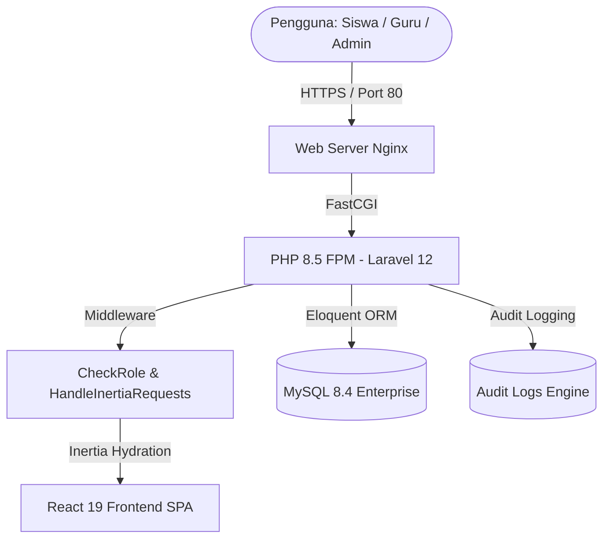

<p align="center">
  
</p>

<h1 align="center">📚 EDUSYNC — Enterprise School Management & Scheduling System</h1>

<p align="center">
  Sistem Informasi Manajemen Sekolah, Jadwal Pelajaran Dinamis, dan Monitoring KBM Real-time Berbasis Standar Kurikulum Merdeka & Dapodik SMK Kejuruan.
</p>

<p align="center">
  
  
  
  
  
  
</p>

---

## 📌 Daftar Isi
1. [Tentang EDUSYNC](#-tentang-edusync)
2. [Fitur Unggulan Sistem](#-fitur-unggulan-sistem)
3. [Arsitektur & Tech Stack](#-arsitektur--tech-stack)
4. [Struktur Portal & Hak Akses](#-struktur-portal--hak-akses)
5. [Integritas Data & Logika Bisnis](#-integritas-data--logika-bisnis)
6. [Akun Demo & Kredensial](#-akun-demo--kredensial)
7. [Panduan Instalasi & Menjalankan Aplikasi](#-panduan-instalasi--menjalankan-aplikasi)
   - [🐧 Panduan untuk Linux (Native)](#-panduan-instalasi-di-linux-ubuntudebian)
   - [🐧 Panduan untuk Linux (Menggunakan Lerd)](#-panduan-instalasi-di-linux-menggunakan-lerd)
   - [🪟 Panduan untuk Windows](#-panduan-instalasi-di-windows)
8. [Rangkaian Pengujian Otomatis (Testing)](#-rangkaian-pengujian-otomatis-testing)
9. [Panduan Deployment Lengkap](#-panduan-deployment-lengkap)
   - [Deployment via Docker](#a-deployment-menggunakan-docker)
   - [Deployment ke Render.com](#b-deployment-ke-rendercom--supabase)
   - [Deployment ke Shared Hosting (cPanel)](#c-deployment-ke-shared-hosting--cpanel)
10. [Struktur Database & Hubungan Model](#-struktur-database--hubungan-model)
11. [Lisensi & Kontribusi](#-lisensi--kontribusi)

---

## 🌟 Tentang EDUSYNC

**EDUSYNC** adalah platform enterprise modern pengelolaan operasional satuan pendidikan kejuruan (SMK) yang mengintegrasikan penyusunan jadwal pelajaran (*dynamic matrix scheduling*), presensi kehadiran siswa & guru harian, penugasan KBM mandiri (jamkos terarah), manajemen izin dinas luar guru, rekap denda kebersihan 5R, hingga verifikasi bukti piket siswa secara terpusat dan *real-time*.

---

## 🚀 Fitur Unggulan Sistem

### 1. 🛡️ Admin Curriculum Control Center
- **Real-time Attendance Analytics**: Dashboard statistik kehadiran terhitung otomatis dan ter-reset setiap pukul 00:00 WIB.
- **KBM Live Monitor & Radar Kelas**: Matriks visual status seluruh ruang kelas.
- **Schedule Builder & Conflict Engine**: Manajemen alokasi JP dengan deteksi tabrakan otomatis.
- **Manajemen Siswa & Guru**: CRUD terpadu dengan sinkronisasi NISN, NIP.
- **Verifikasi Akun Registrasi**: Skema verifikasi (Approve/Reject) bagi pendaftaran akun.
- **Manajemen Inval Guru**: Persetujuan pertukaran guru pengampu.
- **Izin Keluar Dinas Resmi**: Penerbitan disposisi tugas dinas.

### 2. 👨‍🏫 Teacher Workspace (Ruang Kerja Guru)
- **Timeline Mengajar Hari Ini**: Penanda visual jam mengajar.
- **Presensi Harian Mandiri**: Check-in kehadiran harian langsung dari gawai.
- **Pengajuan Inval / Tukar Jam Mengajar**: Pengajuan tukar jam dengan validasi bentrok.
- **Penerbitan Tugas KBM Mandiri**: Publikasi materi terarah.
- **Laporan Kebersihan Ruang Kelas**: Pelaporan kebersihan kepada tim piket.
- **Verifikasi Bukti Piket Siswa**: Pemeriksaan dan ACC bukti foto piket.

### 3. 📱 Student Mobile-First Portal (Ruang Belajar Siswa)
- **Jadwal KBM Real-time**: Tampilan jadwal ramah seluler.
- **Pengunggahan Bukti Piket**: Unggah foto bukti kebersihan harian.
- **Status Denda & Konfirmasi Pelunasan**: Informasi transparansi denda kelas.
- **Akses Tugas KBM Mandiri**: Akses ke tugas dari guru.

---

## 🛠 Arsitektur & Tech Stack

Sistem EDUSYNC dikembangkan menggunakan teknologi terkini (Modern Stack) untuk memastikan skalabilitas dan performa tinggi.


```mermaid
flowchart TD
    User([Pengguna: Siswa / Guru / Admin]) -->|HTTPS / Port 80| Nginx[Web Server Nginx]
    Nginx -->|FastCGI| PHP[PHP 8.5 FPM - Laravel 12]
    PHP -->|Middleware| CheckRole[CheckRole & HandleInertiaRequests]
    CheckRole -->|Inertia Hydration| React[React 19 Frontend SPA]
    PHP -->|Eloquent ORM| MySQL[(MySQL 8.4 Enterprise)]
    PHP -->|Audit Logging| AuditLog[(Audit Logs Engine)]
```

### 🔹 Backend (Server-Side)
- **Framework:** Laravel 12.x
- **Language:** PHP 8.2+ (Direkomendasikan PHP 8.5)
- **Bridge API:** Inertia.js (Menjembatani Laravel dengan React tanpa REST API yang rumit)
- **Authentication:** Laravel Session & Middleware
- **PDF Generation:** `barryvdh/laravel-dompdf`

### 🔹 Frontend (Client-Side)
- **Library Utama:** React 19.x (Modern Hooks, Server Components support)
- **Framework UI:** Tailwind CSS 4.x
- **Build Tool:** Vite 6.x (Super cepat, Hot Module Replacement)
- **State & Data Management:** `@inertiajs/react`
- **Tabel & Grafik:** `@tanstack/react-table`, `chart.js`, `react-chartjs-2`
- **Drag and Drop:** `@dnd-kit/core`
- **Ikonografi:** `lucide-react`

### 🔹 Database & Infrastruktur
- **RDBMS:** MySQL 8.x atau PostgreSQL 15+ (Didukung penuh via Eloquent)
- **Containerization:** Docker & Docker Compose
- **Web Server:** Nginx (via Docker/Production) atau Artisan Serve (Development)

---

## 🔐 Struktur Portal & Hak Akses

| Portal | URL Prefix | Middleware Proteksi | Peran yang Diizinkan |
| :--- | :--- | :--- | :--- |
| **Landing & Profil** | `/` | Guest / Public | Publik |
| **Autentikasi** | `/login`, `/register` | Guest | Pengguna belum masuk |
| **Admin Control** | `/admin/*` | `auth`, `role:admin` | Administrator Kurikulum |
| **Ruang Kerja Guru**| `/guru/*` | `auth`, `role:guru,admin` | Guru, Wali Kelas, Admin |
| **Dashboard Siswa** | `/siswa/*` | `auth`, `role:siswa,admin`| Siswa, Ketua Kelas, Admin |

---

## 🛡️ Integritas Data & Logika Bisnis

Sistem telah diuji dan diamankan:
1. **Schedule Overlap Prevention:** Mencegah bentrok jadwal pengajar, kelas, dan ruangan.
2. **Inval Substitution Integrity:** Mencegah pertukaran jadwal yang tidak sah dan bentrok.
3. **Cash & Penalty Atomicity:** Menggunakan `DB::transaction()` untuk integritas data keuangan (denda kelas).
4. **Account Gatekeeping:** Akun baru (Siswa/Guru) bersifat *pending* dan wajib di-Approve oleh Admin Kurikulum.

---

## 🔑 Akun Demo & Kredensial

| Peran Akun | Email | Kata Sandi | Deskripsi |
| :--- | :--- | :--- | :--- |
| **Admin Kurikulum** | `admin@edusync.test` | `password` | Akses penuh master data & analitik |
| **Guru Pengampu** | `guru1@edusync.test` | `password` | Pengajar produktif kejuruan |
| **Wali Kelas** | `budi.santoso@edusync.test` | `password` | Guru dengan tugas tambahan wali kelas |
| **Siswa / Rombel** | `ahmad.fadillah@edusync.test`| `password` | Siswa kelas XI PPLG 1 |

---

## 💻 Panduan Instalasi & Menjalankan Aplikasi

Aplikasi ini dapat dijalankan baik di sistem operasi Linux, MacOS, maupun Windows. Berikut adalah instruksi lengkap dan mendetail.

### 1. Kebutuhan Sistem Minimum (Prasyarat)
- **PHP:** >= 8.2
- **Composer:** >= 2.5
- **Node.js:** >= 20.x
- **NPM:** >= 10.x
- **Database:** MySQL >= 8.0 atau MariaDB >= 10.6
- **Git**

---

### 🐧 Panduan Instalasi di Linux (Ubuntu/Debian)

Sistem operasi berbasis Linux sangat disarankan untuk development ekosistem PHP/Laravel.

**Langkah 1: Persiapan Lingkungan**
Pastikan dependensi sistem sudah terinstal:
```bash
sudo apt update
sudo apt install php php-cli php-fpm php-mysql php-xml php-mbstring php-curl php-zip unzip curl git
```

**Langkah 2: Clone Repository**
```bash
git clone https://github.com/itsvin-debug/jadwalsekolah.git
cd jadwalsekolah
```

**Langkah 3: Instalasi Dependensi (Backend & Frontend)**
```bash
# Backend
composer install

# Frontend
npm install
```

**Langkah 4: Konfigurasi Environment & Database**
```bash
cp .env.example .env
php artisan key:generate
```
Buat database di MySQL Anda (contoh nama: `edusync_db`). Kemudian buka file `.env` dan atur konfigurasi database:
```env
DB_CONNECTION=mysql
DB_HOST=127.0.0.1
DB_PORT=3306
DB_DATABASE=edusync_db
DB_USERNAME=root
DB_PASSWORD=password_anda
```

**Langkah 5: Migrasi Database & Seeding**
```bash
php artisan migrate --seed
```

**Langkah 6: Menjalankan Aplikasi (Running)**
Anda membutuhkan dua terminal yang berjalan bersamaan.
**Terminal 1 (Backend):**
```bash
php artisan serve
```
**Terminal 2 (Frontend/Vite):**
```bash
npm run dev
```
Akses aplikasi di: **http://127.0.0.1:8000**

---

### 🐧 Panduan Instalasi di Linux (Menggunakan Lerd)

Jika Anda menggunakan sistem operasi berbasis Linux seperti Fedora atau Ubuntu dan memanfaatkan utilitas **Lerd** untuk manajemen environment lokal, setup dapat dilakukan dengan sangat mudah karena Lerd menggunakan Podman untuk isolasi service.

**Langkah 1: Clone Repository & Setup Lerd**
```bash
git clone https://github.com/itsvin-debug/jadwalsekolah.git
cd jadwalsekolah
lerd link
lerd setup
```

**Langkah 2: Konfigurasi Database (.env)**
Sesuaikan kredensial database di file `.env`. Lerd menjalankan MySQL di dalam container dengan *hostname* `lerd-mysql` dan password default `lerd`.
```env
DB_CONNECTION=mysql
DB_HOST=lerd-mysql
DB_PORT=3306
DB_DATABASE=edusync_db
DB_USERNAME=root
DB_PASSWORD=lerd
```

**Langkah 3: Pembuatan Database & Migrasi**
Buat database secara langsung ke dalam container MySQL Lerd, lalu jalankan migrasi database:
```bash
# Membuat database di dalam container lerd-mysql
podman exec -i lerd-mysql mysql -u root -plerd -e "CREATE DATABASE IF NOT EXISTS edusync_db;"

# Menjalankan migrasi
lerd php artisan migrate --seed
```

**Langkah 4: Menjalankan Aplikasi**
Lerd secara otomatis akan menyajikan backend di domain `.test` (contoh: `http://jadwalsekolah.test`). Anda cukup menyalakan compiler frontend di terminal terpisah:
```bash
npm run dev
```
Akses aplikasi di browser menggunakan domain lokal Anda (misalnya: **http://jadwalsekolah.test**).

---

### 🪟 Panduan Instalasi di Windows

Untuk pengguna Windows, disarankan menggunakan **Laragon** atau **XAMPP**. Panduan ini menggunakan contoh XAMPP.

**Langkah 1: Persiapan Lingkungan**
1. Instal [XAMPP](https://www.apachefriends.org/index.html) (Pastikan versi PHP minimal 8.2).
2. Instal [Composer](https://getcomposer.org/download/) untuk Windows.
3. Instal [Node.js](https://nodejs.org/en/) (Versi LTS).
4. Instal [Git Bash](https://git-scm.com/downloads) untuk terminal.

**Langkah 2: Clone Repository**
Buka **Git Bash** dan arahkan ke folder `htdocs` milik XAMPP:
```bash
cd /c/xampp/htdocs
git clone https://github.com/itsvin-debug/jadwalsekolah.git
cd jadwalsekolah
```

**Langkah 3: Instalasi Dependensi**
Masih di Git Bash, jalankan:
```bash
composer install
npm install
```

**Langkah 4: Konfigurasi Environment**
Jalankan perintah berikut:
```bash
cp .env.example .env
php artisan key:generate
```
Buka **XAMPP Control Panel**, pastikan modul **Apache** dan **MySQL** berstatus `Running`. Buka `http://localhost/phpmyadmin` dan buat database baru bernama `edusync_db`.
Edit file `.env` di folder project Anda:
```env
DB_CONNECTION=mysql
DB_HOST=127.0.0.1
DB_PORT=3306
DB_DATABASE=edusync_db
DB_USERNAME=root
DB_PASSWORD=
```

**Langkah 5: Migrasi Database & Seeding**
```bash
php artisan migrate --seed
```

**Langkah 6: Menjalankan Aplikasi (Running)**
Anda membutuhkan dua terminal (Git Bash/Command Prompt) yang berjalan bersamaan di folder project.
**Terminal 1 (Backend):**
```bash
php artisan serve
```
**Terminal 2 (Frontend/Vite):**
```bash
npm run dev
```
Akses aplikasi di browser Anda pada URL: **http://127.0.0.1:8000**

---

## 🧪 Rangkaian Pengujian Otomatis (Testing)

EDUSYNC dilengkapi dengan serangkaian Unit dan Feature Test yang menggunakan **PHPUnit** untuk memastikan logika bisnis dan hak akses tetap aman.

Untuk menjalankan seluruh *test suite*, jalankan perintah berikut di terminal:
```bash
php artisan test
```

**Hasil Ekspektasi:**
```text
   PASS  Tests\Unit\ExampleTest
  ✓ that true is true

   PASS  Tests\Feature\BusinessLogicAuditTest
  ✓ guests are redirected to login                                       0.21s  
  ✓ student cannot access admin portal                                   0.08s  
  ✓ pending user is blocked by middleware                                0.04s  
  ✓ schedule conflict validation on store                                0.06s  
  ✓ teacher cannot swap with themselves                                  0.03s  
  ✓ student cannot resubmit settled fine                                 0.05s  
  ...

  Tests:    12 passed (25 assertions)
  Duration: 1.29s
```

*Catatan untuk Windows:* Pastikan ekstensi `sqlite3` dan `pdo_sqlite` aktif di file `php.ini` XAMPP Anda karena testing biasanya dijalankan di *in-memory sqlite database*.

---

## 🚀 Panduan Deployment Lengkap

EDUSYNC siap untuk dideploy ke lingkungan produksi (Production Ready). Berikut adalah beberapa metode deployment:

### A. Deployment Menggunakan Docker

Proyek ini telah dilengkapi dengan `Dockerfile` dan konfigurasi `docker/` (Nginx + PHP-FPM + Supervisor).
1. Pastikan **Docker** dan **Docker Compose** terinstal.
2. Build image Docker:
   ```bash
   docker build -t edusync-app .
   ```
3. Konfigurasi `docker-compose.yml` (Opsional, jika ingin digabungkan dengan MySQL/PostgreSQL image).
4. Jalankan container:
   ```bash
   docker run -d -p 80:80 --env-file .env edusync-app
   ```

### B. Deployment ke Render.com & Supabase

Metode paling mudah (1-Click Deployment) tanpa harus mengelola server (PaaS).

**1. Persiapan Database (Supabase):**
- Buat project di [Supabase Dashboard](https://supabase.com/).
- Salin kredensial koneksi Database PostgreSQL (Host, Port, User, Password).

**2. Deployment Frontend + Backend (Render.com):**
- Buka [Render Dashboard](https://dashboard.render.com/) -> **New** -> **Blueprint**.
- Hubungkan repository GitHub ini. Sistem Render akan membaca `render.yaml`.
- Masukkan *Environment Variables* di Render:
   - `DB_CONNECTION`: `pgsql`
   - `DB_HOST`: `[host-supabase]`
   - `DB_PORT`: `5432`
   - `DB_DATABASE`: `postgres`
   - `DB_USERNAME`: `postgres.[ref]`
   - `DB_PASSWORD`: `[password-supabase]`
   - `APP_KEY`: *(Generate dari lokal, lalu salin)*
   - `RUN_MIGRATIONS`: `true`
   - `RUN_SEEDER`: `true` (Hanya untuk instalasi pertama)
- Klik **Apply**. Render akan melakukan build image dan menjalankan server secara otomatis.

### C. Deployment ke Shared Hosting (cPanel)

Jika menggunakan layanan shared hosting konvensional (Niagahoster, Hostinger, dll):

1. **Build Frontend Lokal Dulu:**
   Jalankan `npm run build` di komputer Anda lokal. Vite akan membuat folder `public/build/`.
2. **Zip File Proyek:**
   Zip seluruh folder proyek Anda, KECUALI folder `node_modules` (folder `vendor` boleh diikutsertakan jika di hosting tidak ada composer).
3. **Upload ke File Manager cPanel:**
   Upload file zip ke folder `public_html` atau *subdomain folder* Anda, kemudian ekstrak.
4. **Setup Database:**
   Buat database MySQL baru via **MySQL Databases** di cPanel, buat User, dan hubungkan User ke Database tersebut.
5. **Konfigurasi .env:**
   Ubah file `.env` di cPanel, sesuaikan nama database, user, dan password dari langkah ke-4. Ubah `APP_ENV=production` dan `APP_DEBUG=false`.
6. **Migrasi:**
   Jika ada akses terminal SSH di cPanel, jalankan `php artisan migrate --seed`. Jika tidak ada, Anda bisa melakukan dump (export) database lokal Anda lalu import via phpMyAdmin di cPanel.
7. **Symlink Storage:**
   Jalankan `php artisan storage:link` (via SSH Terminal / Cronjob) agar gambar bisa diakses publik.

---

## 📊 Struktur Database & Hubungan Model

- `users`: Data pengguna (Admin, Guru, Siswa).
- `teachers`: Data pengajar (NIP, gelar, beban kerja).
- `departments`: Kompetensi keahlian/jurusan.
- `classrooms`: Rombongan belajar (Rombel).
- `rooms`: Ruang kelas, lab, dan bengkel.
- `subjects`: Mata pelajaran umum & kejuruan.
- `schedules`: Alokasi jadwal matriks KBM mingguan.
- `inval_requests`: Pengajuan substitusi/tukar jam mengajar.
- `teacher_attendances`: Presensi guru harian.
- `learning_tasks`: Tugas mandiri dari guru (Jam Kosong Terarah).
- `official_duty_leaves`: Surat izin keluar kedinasan.
- `trash_reports` & `class_fines`: Modul denda pelanggaran kebersihan (5R).
- `audit_logs`: Log jejak aktivitas.

---

## 📄 Lisensi & Kontribusi

Proyek ini dikembangkan di bawah lisensi open-source **[MIT License](LICENSE)**.

Kontribusi, *Issue Report*, maupun *Pull Request* sangat terbuka! Silakan fork repository ini, buat branch fitur baru Anda, dan ajukan Pull Request.
